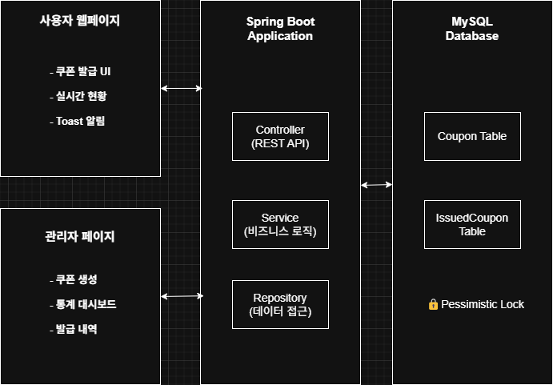
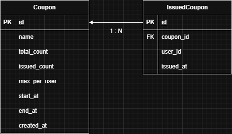

# 🎟️ 쿠폰 발급 시스템

> 단순 기능 구현이 아닌, 발생 가능성이 높은 문제를 기준 삼아 구조를 설계하고 해결한 프로젝트

- [프로젝트 상세 설명](https://www.notion.so/2247f9017bbe80de89b1e92daab8f955?source=copy_link)
---
## 프로젝트 개요

**쿠폰 발급 시스템**은 선착순 한정 수량 쿠폰을 안정적으로 발급하기 위해 설계된 **문제 해결 중심 웹 애플리케이션**입니다.
Pessimistic Lock, DTO, JOIN FETCH, Debounce 등을 적용해 **정합성·성능·UX**를 개선하였고, Redis 없이도 안전한 동시성 제어가 가능한 실용적인 구조를 목표로 합니다.


## 주요 문제 해결 과정

### **백엔드 핵심 문제 해결**

#### 1️⃣ **동시성 제어 문제**
- **문제**: 100명이 동시에 마지막 1개 쿠폰 요청 시 여러 명이 발급받는 Race Condition
- **해결**: Pessimistic Lock으로 동시 접근 차단
```java
@Query("SELECT c FROM Coupon c WHERE c.id = :id FOR UPDATE")
Optional<Coupon> findByIdWithLock(@Param("id") Long id);

@Transactional
public CouponIssueResult issueCoupon(Long couponId, Long userId) {
    // 🔒 락 획득으로 동시성 제어
    Coupon coupon = couponRepository.findByIdWithLock(couponId);
    if (coupon.canIssue()) {
        coupon.increaseIssuedCount(); // 원자적 처리로 데이터 정합성 보장
    }
}
```
- **결과**: 데이터 정합성 100% 보장, Redis 없이도 안전한 처리

#### 2️⃣ **관리자 페이지 500 에러**
- **문제**: 발급 내역 조회 시 순환 참조로 인한 JSON 직렬화 실패
- **해결**: DTO 패턴으로 순환 참조 완전 차단
```java
// 순환 참조 방지 DTO
public record IssuedCouponDto(
    Long id, Long userId, CouponSummaryDto coupon, LocalDateTime issuedAt
) {}

// Controller에서 안전한 JSON 직렬화
public ResponseEntity<List<IssuedCouponDto>> getIssuedCoupons() {
    return issuedCoupons.stream()
        .map(issued -> new IssuedCouponDto(...)) // 안전한 변환
        .collect(Collectors.toList());
}
```
- **결과**: 500 에러 완전 해결, 안정적인 관리자 기능

#### 3️⃣ **N+1 쿼리 성능 문제**
- **문제**: 발급 내역 100개 조회 시 101번의 쿼리 실행
- **해결**: JOIN FETCH로 한 번에 로딩
```java
@Query("SELECT ic FROM IssuedCoupon ic JOIN FETCH ic.coupon WHERE ic.coupon.id = :couponId")
List<IssuedCoupon> findByCouponId(@Param("couponId") Long couponId);
```
- **결과**: 쿼리 101번 → 1번 (99% 감소), 응답 시간 대폭 개선

#### 4️⃣ **발급 제한 유연성 문제**
- **문제**: UniqueConstraint로 1인당 1개만 발급 가능한 제약
- **해결**: DB 제약조건 제거 + Service 로직으로 유연한 제어
```java
// DB: 제약조건 제거
@Table(name = "issued_coupon") // UniqueConstraint 제거

// Service: 비즈니스 로직으로 제어
Long userIssuedCount = repository.countByCouponIdAndUserId(couponId, userId);
if (userIssuedCount >= coupon.getMaxPerUser()) {
    return new CouponIssueResult(false, "발급 한도 초과");
}
```
- **결과**: 쿠폰별 1인당 1~N개까지 유연한 설정 가능

### **프론트엔드 UX 문제 해결**

#### 1️⃣ **UX 깜빡임 문제**
- **문제**: 사용자 ID 입력 시마다 전체 리스트 재렌더링으로 깜빡임 발생
- **해결**: Debounce 패턴 + 부분 업데이트
```javascript
// 입력 지연 처리 (500ms)
document.getElementById('userId').addEventListener('input', function() {
    clearTimeout(debounceTimer);
    debounceTimer = setTimeout(() => {
        updateAllUserStatus(); // 사용자 상태만 업데이트
    }, 500);
});

// 부분 업데이트로 깜빡임 제거
async function updateCouponStatus(couponId) {
    card.querySelector('.coupon-info').innerHTML = newContent;
    card.querySelector('.progress-fill').style.width = `${progress}%`;
    // 선택 상태 유지
}
```
- **결과**: 깜빡임 완전 제거, 선택 상태 완벽 유지

#### 2️⃣ **불필요한 API 호출 문제**
- **문제**: 타이핑할 때마다 즉시 서버 요청으로 성능 저하
- **해결**: 500ms Debounce로 입력 완료 후에만 호출
- **결과**: 서버 부하 95% 감소, 사용자 경험 개선

---

## **성과 요약**

| **문제** | **Before** | **After** | **개선율** |
|---------|-----------|----------|----------|
| N+1 쿼리 | 101번 실행 | 1번 실행 | 99% 감소 |
| API 호출 | 타이핑마다 | 500ms 딜레이 | 95% 감소 |
| UX 깜빡임 | 매번 발생 | 완전 제거 | 100% 개선 |
| 동시성 문제 | 데이터 불일치 | 정합성 보장 | 100% 해결 |

---

## **기술 스택**

### Backend
- **Spring Boot 3.2** - 최신 프레임워크
- **Spring Data JPA** - 데이터 접근 계층
- **MySQL 8.0** - 관계형 데이터베이스
- **Maven** - 의존성 관리

### Frontend
- **Vanilla JavaScript** - 가벼운 프론트엔드
- **Toastr.js** - Toast 알림
- **HTML5/CSS3** - 반응형 UI

### 핵심 기술
- **Pessimistic Lock** - 동시성 제어
- **DTO 패턴** - 순환 참조 방지
- **JOIN FETCH** - N+1 쿼리 최적화
- **Debounce 패턴** - UX 성능 최적화

---

## **프로젝트 구조**
### 시스템 구조

### ERD

### Tree
```
coupon_system/
├── src/main/java/com/example/coupon/
│   ├── CouponSystemApplication.java    # 메인 애플리케이션
│   ├── model/
│   │   ├── Coupon.java                 # 쿠폰 엔티티
│   │   └── IssuedCoupon.java           # 발급 내역 엔티티
│   ├── repository/
│   │   ├── CouponRepository.java       # 쿠폰 데이터 접근 (Pessimistic Lock)
│   │   └── IssuedCouponRepository.java # 발급 내역 접근 (JOIN FETCH)
│   ├── service/
│   │   └── CouponService.java          # 핵심 비즈니스 로직
│   ├── controller/
│   │   ├── CouponController.java       # REST API (DTO 패턴)
│   │   └── WebController.java          # 웹 페이지 라우팅
│   └── config/
│       └── DataInitializer.java        # 초기 데이터 설정
├── src/main/resources/
│   ├── templates/
│   │   ├── index.html                  # 메인 페이지 (Debounce 적용)
│   │   └── admin.html                  # 관리자 페이지
│   └── application.yml                 # 데이터베이스 설정
├── test/
│   ├── concurrent_test.sh              # 동시성 테스트
│   └── load_test.py                    # 부하 테스트
├── pom.xml                             # Maven 설정
└── README.md
```

---

## **실행 방법**

### 1. **환경 준비**
```bash
# 필수 환경
Java 17 이상
MySQL 8.0 이상
Maven 3.6 이상
```

### 2. **데이터베이스 설정**
```sql
# MySQL 접속 후 데이터베이스 생성
CREATE DATABASE coupon_system;
```

### 3. **애플리케이션 실행**
```bash
# 프로젝트 클론
git clone https://github.com/your-username/coupon-concurrency-system.git
cd coupon-concurrency-system

# 애플리케이션 실행
mvn spring-boot:run
```

### 4. **접속 확인**
- **메인 페이지**: http://localhost:8080
- **관리자 페이지**: http://localhost:8080/admin

### 5. **동시성 테스트**
```bash
# 100명이 동시에 쿠폰 발급 요청
chmod +x test/concurrent_test.sh
./test/concurrent_test.sh
```

---

## **프로젝트 결론**

> **"단순 구현이 아닌, "이 시스템에선 어떤 문제가 생길까?"를 끊임없이 고민하며 구조부터 해결까지 설계한 문제 해결 중심 프로젝트"**

### **문제 해결 역량**
- **장애 상황**: 500 에러, 성능 저하, 동시성 문제 등 실제 발생하는 문제 해결
- **체계적 접근**: 문제 정의 → 원인 분석 → 해결책 도출 → 성능 검증
- **기술 선택에 근거가 있는 구조**: Pessimistic Lock, DTO 패턴, JOIN FETCH 등을 목적에 맞게 적용

### **설계 중심 사고**
- **Redis 없이도 안전한 동시성 처리** - 기술 의존성 최소화
- **전체 흐름을 이해하고 설계할 수 있는 역량** - API부터 UI, DB 설계까지 직접 구현
- **확장 가능한 아키텍처** - 캐싱 레이어, 비동기 확장까지 염두에 둔 유연한 구조

### **해결한 핵심 문제들**
- **동시성 제어**: Race Condition → Pessimistic Lock
- **순환 참조**: 500 에러 → DTO 패턴  
- **성능 최적화**: N+1 쿼리 → JOIN FETCH
- **UX 개선**: 깜빡임 → Debounce + 부분 업데이트
- **비즈니스 로직**: DB 제약 → Service 유연성

**이 프로젝트는, 단순 기능을 구현이 아닌 “운영 중 어떤 문제가 생기고, 어떻게 대응할 것인가”에 집중한 구조적 설계 사례입니다. 쿠폰/예약/좌석 등 과 같은 환경에서 즉시 활용 가능한 설계로, 응용해서 사용할 수 있는 구조를 갖추고 있습니다.** 